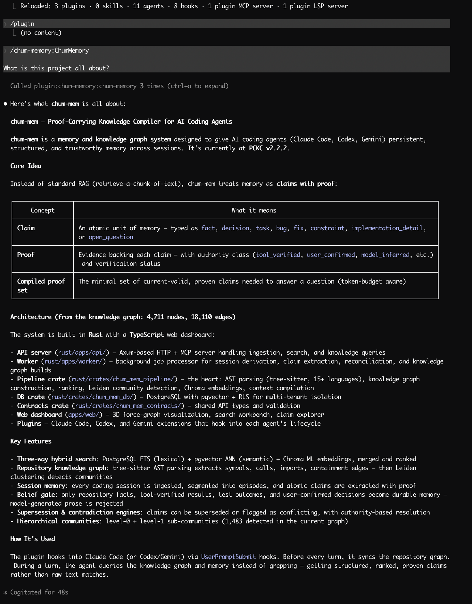

# chum-mem



## Why this exists

Standard RAG retrieval returns chunks of text ranked by similarity. That's fine for document Q&A, but coding agents need more:

- **"What calls function X?"** — requires structural graph edges, not text similarity
- **"What was the last decision about caching?"** — requires claim-type filtering and supersession tracking
- **"Resume the refactor I started yesterday"** — requires session continuity with proof of prior state
- **"Is this still true?"** — requires temporal validity and contradiction detection

chum-mem solves these by maintaining two isolated knowledge graph layers, extracting atomic claims with proof handles, and compiling token-budgeted context packs from the minimal set of current-valid claims needed to answer a question.

## The PCKC Model

The **Proof-Carrying Knowledge Compiler** redefines three units of AI memory:

| Unit | Standard RAG | PCKC |
|------|-------------|------|
| **Memory** | Text chunks / summaries | **Claim** — an atomic, typed assertion: `fact`, `decision`, `task`, `constraint`, `bug`, `fix`, `implementation_detail`, or `open_question` |
| **Trust** | "Source: file X" | **Proof** — structured evidence with `authority_class` (tool_verified, user_confirmed, repository_derived, session_derived, model_inferred), `verification_status` (verified, unverified, refuted, superseded), `proof_type`, `source_ref`, and `excerpt` |
| **Context** | Top-k similar text | **Compiled minimal proof set** — the smallest set of current-valid claims whose proof is sufficient to answer, assembled within a token budget |

### How claims flow through the system

```
Raw session events
  → Episode segmentation (conversation / implementation / debugging)
  → Atomic claim extraction with authority classification
  → Proof attachment (links each claim to source evidence)
  → Belief gate (rejects model-generated prose — only repository facts,
     tool-verified results, test outcomes, and user-confirmed decisions
     become durable memory)
  → Contradiction engine (detects conflicts between claims)
  → Supersession engine (marks stale claims when newer ones arrive)
  → Knowledge graph persistence with Leiden community detection
```

### Belief gate

Model-generated prose is **not** durable memory. The belief gate enforces this server-side during claim extraction:

- `Reasoning` and `TurnContext` events are **hard-rejected** before text analysis — rejection by construction, not by fallthrough
- `AgentMessage` goes through the standard classifier chain and is rejected unless user-confirmed
- Only four authority classes survive into durable memory: `tool_verified`, `user_confirmed`, `repository_derived`, `test_verified`
- Benchmark-verified: 0 reasoning leaks, 0 model-derived durable claims across all test runs

### Supersession and contradiction

Claims are not append-only. When a new claim contradicts an existing one:

- The **contradiction engine** links them with `contradicts` edges and increments `activeConflictCount`
- The **supersession engine** creates `supersedes` edges when a newer claim from a higher authority replaces an older one
- Retrieval respects temporal validity: claims past `valid_to` or with `superseded_by` set are hidden by default
- Agents surface conflicts explicitly rather than silently averaging contradictory information

### Three-way hybrid search

Retrieval merges three signal sources:

| Source | Weight | What it finds |
|--------|--------|--------------|
| PostgreSQL full-text search (lexical) | 32% | Exact keyword matches, structured claim fields |
| pgvector ANN (semantic) | 30% | Conceptually similar claims via embeddings |
| ChromaDB ML embeddings | — | Per-type partitioned collections for precision |

Additional ranking signals: session relevance (12%), graph proximity (10%), recency/importance/confidence (16%).

**Typed embedding partitions**: When `mem_search` receives `types: ["bug", "fix"]`, it routes to per-type Chroma collections (`memories_bug`, `memories_fix`). v2.2.2 achieves **1.000 typed search precision** — every result matches the requested type.

### Hierarchical communities

Community detection uses the Leiden algorithm at two levels:

- **Level 0**: Coarse clusters (141 communities from 68K session nodes)
- **Level 1**: Sub-communities within large clusters (1,192 sub-communities)

God Node damping prevents high-degree nodes (session hubs, import hubs) from dominating community structure. Nodes above the 95th percentile degree get `1/ln(degree)` weight reduction during clustering.

## Two graph layers

chum-mem maintains two isolated knowledge graphs per project:

### Repository layer

Built from code via tree-sitter AST parsing across **19 languages**. Extracts:

- **Symbols**: functions, classes, structs, traits, interfaces, enums, modules, constants, fields
- **Containment**: method→class, field→struct edges (enables "methods of class X" without grep)
- **Cross-file call resolution**: two-pass global symbol table resolves calls across file boundaries
- **Imports**: language-specific resolution (ES6, Python, Go, Rust `use`, C `#include`, etc.)
- **Type edges**: parameter types, return types linked to type nodes
- **Rationale comments**: `WHY:`, `NOTE:`, `IMPORTANT:`, `TODO:`, `FIXME:` tags → rationale nodes

Supported: Python, TypeScript, TSX, JavaScript, Go, Rust, Java, C, C++, Ruby, C#, Kotlin, Scala, PHP, Swift, Lua, Zig, Elixir, Julia. Unsupported extensions fall back to regex extraction.

The repository graph refreshes automatically via a client hook before every agent turn. Steady-state cost: **~108ms** (no API calls when files haven't changed).

### Session layer

Built from ingested coding sessions. Captures:

- Prompts, tool calls, file changes, errors, test results, commands
- Derived atomic claims with proof handles and authority classification
- Episode segmentation (conversation / implementation / debugging boundaries)
- Cross-session patterns and causal chains

The session layer accumulates across sessions. Current production graph: **68K nodes, 149K edges, 1,333 communities**.

### Layer isolation

The two layers are structurally isolated — repository imports never merge into session graphs. All query tools accept a `layer` parameter (`"repository"` or `"session"`). Cross-layer contamination is benchmark-verified at 0.

## Quick start

### Prerequisites

- Docker and Docker Compose
- Rust toolchain (for development)
- Node.js 20+ and pnpm (for benchmarks and web dashboard)

### Start the stack

```bash
docker compose up -d --build

# Verify
curl -s http://127.0.0.1:65301/ready
```

The API serves both HTTP REST and MCP (Streamable HTTP) on the same port:
- Health: `GET /ready`
- MCP: `POST /mcp`

### Install the agent plugin

```bash
chmod +x ./plugin-install.sh

# Claude Code
./plugin-install.sh claude local

# Codex
./plugin-install.sh codex local

# Gemini
./plugin-install.sh gemini local
```

Once installed, the plugin hook runs automatically on every agent turn — no manual setup required.

### Ingest your chat history

Import existing Claude/Codex sessions so the knowledge graph starts with full context:

```bash
# Import all sessions (re-ingest everything, 10 sessions in parallel)
pnpm sessions:import --fresh --yes --concurrency 10

# Incremental (skip already-completed sessions — safe to run repeatedly)
pnpm sessions:import --yes

# Preview what would be imported
pnpm sessions:import --dry-run

# Import only recent sessions
pnpm sessions:import --from 2026-04-01 --yes
```

Each imported session triggers the full PCKC derivation chain: episode segmentation, claim extraction, proof attachment, contradiction/supersession detection, and knowledge graph build. The worker processes these jobs automatically in the background.

See [docs/INGESTION_GUIDE.md](docs/INGESTION_GUIDE.md) for all flags (`--roots`, `--batch-size`, `--max-files`, `--from`/`--to`, etc.).

## Data ingestion

Both layers feed from the same agent plugin hook (`hook-dispatch.sh`), which fires two scripts in parallel:

### Repository: `sync.sh` → `POST /api/knowledge/repository-sync`

1. Enumerates files via `git ls-files`, applies sync rules, SHA-256 hashes each file
2. Diffs against the cached manifest — only changed/new files are sent
3. If nothing changed, exits in **~108ms** with zero API calls
4. Otherwise POSTs file contents; the API parses via tree-sitter, merges into the graph, re-runs Leiden clustering

### Sessions: `session-sync.sh` → `/v1/ingest/session/*`

1. On `SessionStart`: creates a session record via the API
2. On every event (prompts, tool calls, file changes): appends to the session event stream
3. On `Stop`: posts the final response event, calls `session_end`
4. `session_end` enqueues the PCKC derivation chain — episode segmentation, claim extraction, proof attachment, contradiction/supersession engines, knowledge graph build

The agent never calls these manually. The hook handles everything.

## Benchmarks

Measured against the live Docker Compose stack. Full methodology in `docs/research/`.

### Quality (v2.2.2 vs v2.2.1)

| Metric | v2.2.1 | v2.2.2 | Threshold |
|--------|--------|--------|-----------|
| Pass rate (legacy 12 metrics) | 7/12 (58%) | **10/12 (83%)** | — |
| Pass rate (expanded 18 metrics) | — | **14/18 (77%)** | — |
| Retrieval noise: relevant in top 5 | 1 | **4** | >=3 |
| Retrieval noise: irrelevant in top 5 | 4 | **1** | <=1 |
| Claim type fit (continuation) | 0.343 | **1.000** | >=0.7 |
| Typed search precision | — | **1.000** | >=0.8 |
| Belief gate: reasoning leaks | 0 | **0** | 0 |
| Cross-layer contamination | 0 | **0** | 0 |
| Containment edges | N/A | **true** | true |
| Cross-file call resolution | N/A | **true** | true |
| Hierarchical communities | N/A | **true** | true |
| Hub quality (forbidden types) | — | **0** | 0 |

### Latency (warm cache, p50)

| Operation | Latency |
|-----------|---------|
| `mem_search` (hybrid) | **38–95ms** |
| `knowledge_query` (search) | **27ms** |
| `knowledge_query` (hub_nodes) | **24ms** |
| `knowledge_report` | **150ms** |
| `sync.sh` steady-state (no changes) | **~108ms** |
| `sync.sh` incremental (1 file) | **~567ms** |
| Full hook dispatch (UserPromptSubmit) | **~241ms** |

### Version progression

| Version | Pass rate | Key improvement |
|---------|-----------|----------------|
| v2.1 | Baseline | Initial hybrid search |
| v2.2 | — | PCKC claim model, typed claims, belief gate |
| v2.2.1 | 7/12 (58%) | Supersession correctness, belief gate verified |
| **v2.2.2** | **10/12 (83%)** | Typed partitions, cross-file calls, hierarchical communities |

## Architecture

```
┌─────────────────────────────────────────────────────────────────┐
│  Agent Plugins (Claude Code / Codex / Gemini)                   │
│  hook-dispatch.sh → sync.sh + session-sync.sh                   │
└────────────┬──────────────────────────────┬─────────────────────┘
             │ repository-sync              │ session events
             ▼                              ▼
┌─────────────────────────────────────────────────────────────────┐
│  API Server (Rust/Axum)                                         │
│  HTTP REST + MCP Streamable HTTP                                │
│  ┌──────────────┐  ┌──────────────┐  ┌────────────────────┐    │
│  │ Knowledge     │  │ Memory       │  │ Context Compiler   │    │
│  │ Graph Queries │  │ Search       │  │ (minimal proof set)│    │
│  └──────────────┘  └──────────────┘  └────────────────────┘    │
└────────────┬──────────────────────────────┬─────────────────────┘
             │                              │
             ▼                              ▼
┌──────────────────────┐    ┌──────────────────────────────────┐
│  PostgreSQL           │    │  Worker (background jobs)         │
│  + pgvector           │    │  Episode segmentation             │
│  + RLS (multi-tenant) │    │  Claim extraction + proof attach  │
│  + FTS (lexical)      │    │  Contradiction / supersession     │
│                       │    │  Leiden community detection       │
│                       │    │  Chroma embedding sync            │
└──────────────────────┘    └──────────────────────────────────┘
             │
             ▼
┌──────────────────────┐
│  ChromaDB             │
│  Typed partitions     │
│  (memories_bug,       │
│   memories_decision,  │
│   etc.)               │
└──────────────────────┘
```

## Stack

- **Rust workspace**: `rust/apps/api`, `rust/apps/worker`, `rust/crates/*`
- **Tree-sitter**: 17 grammar crates (19 languages)
- **Leiden algorithm**: hierarchical community detection (level-0 + level-1)
- **PostgreSQL + pgvector**: storage, full-text search, vector ANN, RLS multi-tenancy
- **ChromaDB**: typed embedding partitions for per-claim-type precision
- **Docker Compose**: service packaging (API, worker, Postgres, Chroma)
- **MCP protocol**: Streamable HTTP transport
- **Web dashboard** (`apps/web/`): 3D force-graph visualization, search workbench, claim explorer

## Documentation

- [docs/ARCHITECTURE.md](docs/ARCHITECTURE.md) — system diagram and data flow
- [docs/ARCHITECTURE_SPEC.md](docs/ARCHITECTURE_SPEC.md) — system objectives and specification
- [docs/KNOWLEDGE_MODEL.md](docs/KNOWLEDGE_MODEL.md) — graph schema, evidence levels, community detection
- [docs/GRAPHIFY_COMPLETION.md](docs/GRAPHIFY_COMPLETION.md) — repository knowledge graph details
- [docs/API_CONTRACTS.md](docs/API_CONTRACTS.md) — MCP tool contracts
- [docs/INGESTION_GUIDE.md](docs/INGESTION_GUIDE.md) — session ingestion workflow
- [docs/research/v2.2.2-pckc/](docs/research/v2.2.2-pckc/) — v2.2.2 research, design, and benchmark results

## Volume backup and restore

Persistent runtime data lives in Docker volumes (`postgres_data`, `chroma_data`):

```bash
# Backup
pnpm volumes:backup

# Restore
pnpm volumes:restore -- ./backups/<timestamp>
```

## Tests

```bash
cargo test -p chum-mem-pipeline

# 33 tests: AST parser (20), Leiden clustering (8), repository (3), derivation + knowledge (2)
```

## Acknowledgments

- **[Graphify](https://github.com/safishamsi/graphify)** (Safi Shamsi) — Prior art for repository knowledge graphs. God Node analysis, Leiden community detection, cross-file call resolution, and confidence-scored edges. chum-mem's repository layer directly builds on patterns Graphify pioneered for repo understanding.
- **[Karpathy's knowledge base](https://github.com/karpathy)** — Inspiration for treating knowledge as structured.
- **[GraphRAG](https://arxiv.org/abs/2404.16130)** (Microsoft Research) — Hierarchical Leiden communities with map-reduce global queries. chum-mem's two-level community detection and community-aware retrieval routing are directly influenced by this work.
- **[NeuroPath](https://arxiv.org/abs/2511.14096)** (NeurIPS 2025) — Goal-directed semantic path pruning over knowledge graphs. The 16.3% recall improvement and 22.8% token reduction results informed chum-mem's `goal_directed` query mode.
- **[MiniRAG](https://arxiv.org/abs/2501.06713)** — Semantic-aware heterogeneous graph indexing. The idea of combining different node types (code symbols, session claims, documents) in one unified structure influenced the cross-layer edge design.

