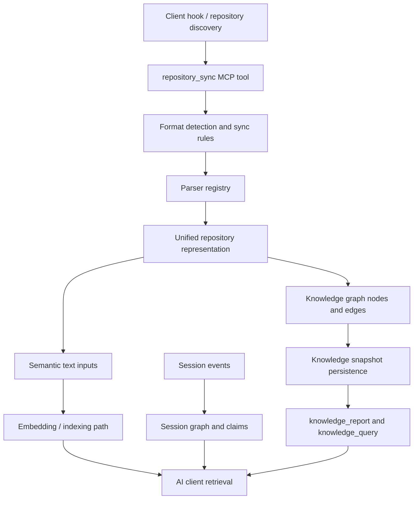

# Repository Layer E2E QA Package

Status: executable parser/graph QA added; service-level E2E gates defined for CI environments with API, PostgreSQL, pgvector, and Chroma.

## 1. E2E Test Strategy

The repository layer must be tested in three rings:

1. Parser and normalization ring: pure Rust tests call `parse_file_payload_batch` and `sync_rules` directly. This is fast, deterministic, and runs in regular unit CI.
2. API and AI-client ring: API-level tests call MCP/HTTP `repository_sync`, `knowledge_query`, `knowledge_report`, `mem_search`, and `context_compile_v2` against a running API and storage stack.
3. Production-readiness ring: security, concurrency, large-batch, and performance tests run in scheduled or pre-release CI because they require realistic storage, worker, and embedding dependencies.

The PCKC v2.2.3 invariant for all rings is unchanged: repository graph truth is primary, session memory is secondary proof, and retrieval output must preserve provenance/source references instead of replacing evidence with narrative summaries.

## 2. Architecture Under Test



## 3. Test Matrix

| Category | Extensions | Primary assertions |
|---|---|---|
| Code | `.py`, `.ts`, `.js`, `.jsx`, `.tsx`, `.go`, `.rs`, `.java`, `.c`, `.cpp`, `.rb`, `.cs`, `.kt`, `.scala`, `.php`, `.swift`, `.lua`, `.zig`, `.ps1`, `.ex`, `.exs`, `.m`, `.jl`, `.vue`, `.svelte`, `.sql` | accepted by sync rules; normalized as `file`; symbols/classes/modules extracted where supported; comments/rationale preserved; syntax errors produce partial graph, not crash |
| Text/markup | `.md`, `.mdx`, `.html`, `.txt`, `.rst`, `.yaml`, `.yml` | accepted by sync rules; normalized as `document`; headings/root sections emitted; links/file mentions preserved; unsafe HTML must not become executable downstream |
| Documents | `.docx`, `.xlsx`, `.pptx`, `.pdf` | accepted as binary payloads; parser metadata selected; extractable text becomes sections/semantic input; corrupt/protected files produce diagnostics |
| Images | `.png`, `.jpg`, `.webp`, `.gif` | accepted as binary payloads; dimensions and size captured; `needsVisionPass` set; corrupt images produce diagnostics |
| Media | `.mp4`, `.mov`, `.mp3`, `.wav` | accepted as binary payloads; container/header metadata captured; `needsTranscriptPass` set; corrupt media produces diagnostics |

## 4. Positive Test Cases

| ID | Case | Expected result |
|---|---|---|
| POS-001 | Ingest one valid file for every supported extension in a single mixed batch | Every file produces a normalized node with `fullPath`, `extension`, `repositoryFileKind`, and stable `sourceId` |
| POS-002 | Code files with functions/classes/imports/doc comments | Symbol nodes and `defines`/`imports` edges are emitted where grammar support exists; regex fallback still emits file nodes |
| POS-003 | Markdown with headings, links, and code fences | Section nodes are emitted for headings and source references remain queryable |
| POS-004 | MDX with frontmatter and embedded components | File is accepted; frontmatter/component text is preserved as source text, not executed |
| POS-005 | DOCX with paragraphs/headings | `docx-ooxml` parser metadata is present and document sections are emitted |
| POS-006 | XLSX with shared strings and worksheet rows | `xlsx-ooxml` parser metadata is present and sheet sections are emitted |
| POS-007 | PPTX with slide text | `pptx-ooxml` parser metadata is present and slide sections are emitted |
| POS-008 | PDF with selectable text | `pdf-best-effort` metadata is present and a PDF text section is emitted |
| POS-009 | PNG/JPG/WebP/GIF | `image-header` metadata is present with width/height where decodable |
| POS-010 | WAV/MP3/MP4/MOV | `media-header` metadata is present with format metadata where decodable |
| POS-011 | Repository graph query for indexed content | `knowledge_query(search, layer:"repository")` returns file/section nodes with source paths and metadata |
| POS-012 | Re-ingestion of changed file | Old nodes for the same `sourceId` are removed and replaced; stale diagnostics do not persist |

## 5. Negative Test Cases

| ID | Case | Expected result |
|---|---|---|
| NEG-001 | Empty files | Metadata-only or root nodes are emitted without panic |
| NEG-002 | Unknown extension | `repositoryFileKind=unsupported`, parser `metadata-only`, diagnostic node emitted |
| NEG-003 | Mismatched MIME type and extension | Extension-based parser remains deterministic; service-level API should log mismatch and mark diagnostic metadata |
| NEG-004 | Corrupted DOCX/XLSX/PPTX/PDF/image/media | Healthy files in the batch still process; corrupted files emit diagnostic nodes |
| NEG-005 | Invalid UTF-8 text file | Metadata-only node and diagnostic; no panic |
| NEG-006 | Oversized text file | Skipped or rejected according to `maxFileSizeBytes` |
| NEG-007 | Oversized binary file | Metadata-only node or structured rejection according to `maxBinaryFileSizeBytes` |
| NEG-008 | Duplicate file paths in one batch | Last writer wins or deterministic de-duplication; no duplicate graph nodes |
| NEG-009 | Deep nested path | Accepted if under root and not ignored; source path remains normalized |
| NEG-010 | Permission denied during filesystem discovery | File is skipped with useful logs; batch continues |
| NEG-011 | Partial batch failure | Successful files remain indexed; failure count and diagnostics are returned |

## 6. Security Test Cases

| ID | Case | Expected result |
|---|---|---|
| SEC-001 | `../outside.md`, absolute paths, Windows drive traversal | API rejects or canonicalizes to project-relative safe path; no graph node outside project scope |
| SEC-002 | HTML with `<script>`, event handlers, `javascript:` URLs | Unsafe executable content is stripped or encoded before any dashboard/client rendering |
| SEC-003 | Archive bomb OOXML container | ZIP entry count, compression ratio, and expanded byte limits prevent decompression abuse |
| SEC-004 | File type spoofing | Mismatch logged and exposed in diagnostics; parser does not trust MIME alone |
| SEC-005 | Malicious metadata strings | Metadata is escaped in report/dashboard/API outputs |
| SEC-006 | Secrets in files | Ignored patterns exclude common secrets; future secret scanner should redact or classify policy hits |
| SEC-007 | Project/session isolation | Project A token/session cannot query repository graph or memories from Project B |
| SEC-008 | Revoked/expired token | All repository sync and retrieval endpoints reject before data access |
| SEC-009 | Replay/idempotency | Replayed sync with same hash does not duplicate nodes, edges, or embeddings |

## 7. Performance Test Cases

| Metric | Threshold | Test shape |
|---|---:|---|
| Single small text/code file ingest | p95 <= 50 ms parser ring | Direct `parse_file_payload_batch` |
| Single binary metadata ingest | p95 <= 100 ms parser ring | DOCX/XLSX/PPTX/PDF/image/media fixture |
| Mixed 100-file batch | p95 <= 2 s parser ring | 70 code/text, 20 docs, 10 media/image |
| Large repo sync | p95 <= 60 s service ring | 5k files, under configured caps |
| Retrieval latency | p95 <= 250 ms warm graph cache | `knowledge_query(search)` and `neighbors` |
| Concurrent AI-client queries | no errors, p95 <= 500 ms | 25 concurrent query clients |
| Concurrent session ingestion | no cross-project leakage | 10 sessions, 2 projects |
| Memory usage | no unbounded growth | RSS stable under repeated 100-file batches |

## 8. Session-Layer Integration Tests

| ID | Case | Expected result |
|---|---|---|
| SES-001 | Start session, sync repository, query repository layer | Repository graph is project-scoped and available to the session's client |
| SES-002 | Append prompt/tool/result events referencing synced files | Session graph links to repository source paths without merging layers |
| SES-003 | End session and derive memories | Claims include proof handles back to session events and repository-derived source references where applicable |
| SES-004 | Session-scoped query | Session-layer query returns only session-relevant nodes unless explicit project/global fallback is intended |
| SES-005 | Delete or isolate session | Session-derived memories/edges are removed or hidden without deleting project repository truth |
| SES-006 | Concurrent sessions in different projects | No graph, memory, or context-pack leakage |

## 9. AI-Client Retrieval Tests

| ID | Client path | Assertions |
|---|---|---|
| AI-001 | MCP `knowledge_report(layer:"repository")` | Markdown includes Summary, Node Types, Edge Relations, God Nodes, Communities |
| AI-002 | MCP `knowledge_query(search, layer:"repository")` | Returns `nodes[]`, `edges[]`, `metadata.query`, source file paths, metadata |
| AI-003 | MCP `knowledge_query(search, layer:"session")` | Queryable independently from repository layer |
| AI-004 | MCP `mem_search` after sync/session events | Returns current, governance-aware claims with proof handles |
| AI-005 | MCP `context_compile_v2` | Emits hard-budget proof set and `proof_gap` markers when repository-derived proof is missing |
| AI-006 | Concurrent Codex/Claude/Gemini clients | Token/project scope enforced and results remain deterministic enough for repeatable tests |

## 10. Required Fixtures

| Fixture | Contents |
|---|---|
| `fixtures/code/all-extensions/*` | One small valid source file per code extension, plus syntax-error and large-file variants |
| `fixtures/docs/markdown.md` | headings, links, code fences, frontmatter |
| `fixtures/docs/mdx.mdx` | frontmatter and embedded JSX component |
| `fixtures/docs/html.html` | meaningful text plus unsafe script/event attributes |
| `fixtures/docs/config.yaml` | nested keys, arrays, booleans |
| `fixtures/binary/sample.docx` | paragraphs, headings, table |
| `fixtures/binary/sample.xlsx` | two sheets, formulas, shared strings |
| `fixtures/binary/sample.pptx` | titles, slide body, speaker notes |
| `fixtures/binary/selectable.pdf` | selectable text |
| `fixtures/binary/scanned.pdf` | image-only PDF |
| `fixtures/images/*` | PNG, JPG, WebP, static GIF, animated GIF, large image |
| `fixtures/media/*` | WAV, MP3 with ID3, MP4, MOV, large media |
| `fixtures/corrupt/*` | invalid ZIP, invalid PDF, bad image header, invalid UTF-8 |
| `fixtures/security/*` | path traversal names, spoofed MIME, malicious HTML, archive-bomb candidate |

The added Rust test creates minimal in-memory fixtures for the parser ring. API-level CI should use real files stored under `tests/fixtures/repository-layer/`.

## 11. Automation Approach

Fast CI:

```bash
cargo test -p chum-mem-pipeline --test repository_layer_e2e
cargo test -p chum-mem-pipeline repository::tests -- --nocapture
cargo test -p chum-mem-contracts
pnpm --filter @chum-mem/contracts test
```

Service E2E CI:

```bash
pnpm test:e2e:repository
pnpm bench:repository-ingest
```

Recommended service flow:

1. Start API, worker, PostgreSQL, pgvector, and Chroma using CI services.
2. Resolve two projects and mint scoped test tokens.
3. Call `sync_rules` and verify extension contract.
4. Call MCP `repository_sync` with mixed text and `bytesBase64` payloads.
5. Poll or wait for graph snapshot availability.
6. Call `knowledge_report`, `knowledge_query`, `mem_search`, and `context_compile_v2`.
7. Append session events and validate repository/session layer separation.
8. Run isolation, replay, and concurrency checks.
9. Capture API logs and assert no panic/error-level entries except expected structured diagnostics.

## 12. Suggested Folder Structure

```text
rust/crates/chum_mem_pipeline/tests/
  repository_layer_e2e.rs
tests/
  e2e/
    repository-layer/
      repository-sync.e2e.test.ts
      ai-client-retrieval.e2e.test.ts
      session-isolation.e2e.test.ts
      security.e2e.test.ts
      performance.e2e.test.ts
  fixtures/
    repository-layer/
      code/
      docs/
      binary/
      images/
      media/
      corrupt/
      security/
docs/qa/
  repository-layer-e2e.md
```

## 13. Example Test Code

Rust parser/graph test now exists in `rust/crates/chum_mem_pipeline/tests/repository_layer_e2e.rs`.

API-level Vitest skeleton:

```ts
import { describe, expect, it } from "vitest";

const api = process.env.CHUM_MEM_API_URL ?? "http://127.0.0.1:8080";
const token = process.env.CHUM_MEM_TEST_TOKEN!;

async function mcp(method: string, params: unknown) {
  const response = await fetch(`${api}/mcp`, {
    method: "POST",
    headers: {
      "content-type": "application/json",
      authorization: `Bearer ${token}`,
    },
    body: JSON.stringify({
      jsonrpc: "2.0",
      id: crypto.randomUUID(),
      method: "tools/call",
      params: { name: method, arguments: params },
    }),
  });
  expect(response.ok).toBe(true);
  return response.json();
}

describe("repository layer E2E", () => {
  it("syncs mixed file types and exposes repository query results", async () => {
    await mcp("repository_sync", {
      files: [
        { path: "src/app.rs", hash: "h1", content: "pub fn answer() -> i32 { 42 }" },
        {
          path: "docs/spec.md",
          hash: "h2",
          content: "# Retrieval Spec\nAI clients need source references.",
        },
      ],
      removedPaths: [],
      mergeWithExisting: true,
    });

    const report = await mcp("knowledge_report", { layer: "repository" });
    expect(report.result.content[0].text).toContain("## Summary");

    const query = await mcp("knowledge_query", {
      layer: "repository",
      query: "search",
      text: "answer app.rs",
    });
    expect(JSON.stringify(query)).toContain("src/app.rs");
  });

  it("keeps project/session scopes isolated", async () => {
    const projectA = await mcp("knowledge_query", {
      layer: "repository",
      query: "search",
      text: "project-a-only-secret",
    });
    expect(JSON.stringify(projectA)).toContain("project-a");

    // Repeat with a Project B token and assert Project A content is absent.
  });
});
```

## 14. Pass/Fail Criteria

Pass:

- all required extensions are accepted by sync rules
- every supported format produces a normalized file/document node
- parser-specific metadata exists for document/image/media formats
- corrupted and unsupported files produce structured diagnostics without crashing a mixed batch
- repository query returns source paths and metadata for AI clients
- API-level tests show no tenant/session leakage
- performance thresholds are met at p95
- logs contain structured diagnostics and no unhandled panics

Fail:

- any supported extension is missing from sync rules
- a malformed file crashes ingestion or blocks healthy files
- any output omits source path/provenance metadata
- repository and session layers leak across projects or users
- script/metadata injection is rendered unsafely
- context compilation silently truncates without proof-gap markers
- p95 ingest/query latency exceeds thresholds without a documented exception

## 15. Current Production Readiness Checklist

| Gate | Status | Notes |
|---|---|---|
| Sync rules cover required formats | Automated | `repository_layer_e2e.rs` |
| Parser selection for OOXML/PDF/image/media | Automated | validates parser metadata |
| All required extensions accepted | Automated | validates normalized nodes |
| Mixed batch corrupted-file behavior | Automated | validates diagnostics and healthy-file survival |
| Oversized binary handling | Automated | validates metadata-only fallback |
| Repository graph query source references | Automated | validates graph search results |
| HTML sanitization | Needs service/UI security test | parser currently treats HTML as text; renderer/API must escape or sanitizer must be added |
| OCR for images/scanned PDFs | Not supported | current behavior should route/fail gracefully with diagnostics |
| Transcription for audio/video | Not supported | current behavior marks `needsTranscriptPass` |
| Full content chunk retrieval for binary docs | Needs follow-up | current graph exposes file/section metadata; semantic content is not yet a first-class retrievable chunk for all binary formats |
| API `repository_sync` bytesBase64 E2E | Needs service CI | requires API + storage stack |
| Session persistence/isolation E2E | Needs service CI | requires API + DB + worker |
| Tenant/token isolation E2E | Needs service CI | use security test harness |
| Performance/load benchmarks | Needs service CI | thresholds defined above |

Production readiness decision: not fully production-ready until service-level E2E, tenant/session isolation, HTML sanitization, full content retrieval, and performance gates are automated and passing.
