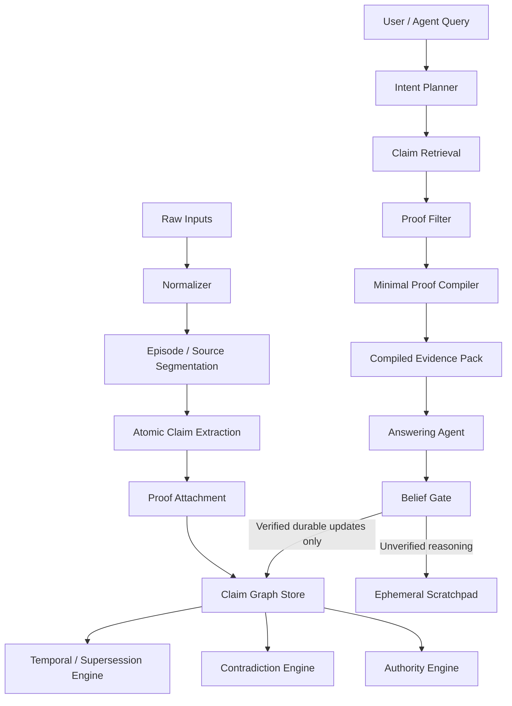
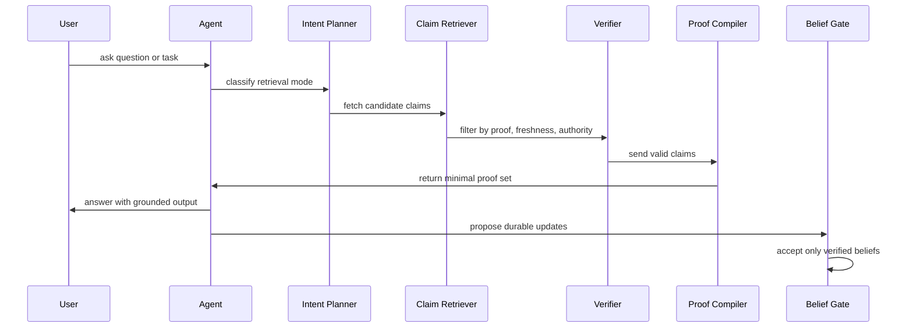

# v2.2 Research Draft: Proof-Carrying Knowledge Compiler

Date: 2026-04-14
Branch: `v2.2`
Status: draft for architecture and benchmark-driven implementation

## Summary

`v2.2` proposes a shift from retrieval-as-search to retrieval-as-compiled-evidence.

The current `v2.1` runtime is already better than naive RAG:
- source classes are separated
- `context_build` routes by retrieval intent
- repository and session knowledge layers are split
- ranking suppresses some noisy summaries

But it is still not enough to stop:
- noisy session summaries from crowding retrieval
- stale continuity from surviving too long
- provenance-heavy packs from wasting tokens
- debugging flows from falling back to file search instead of trusted knowledge
- hallucinated intermediate beliefs from compounding across steps

The `v2.2` proposal is a new retrieval model:

**Proof-Carrying Knowledge Compiler (PCKC)**

PCKC treats retrieval as a compilation problem:
- ingest raw sources and sessions into atomic claims
- attach proof to each claim
- maintain supersession and contradiction state over time
- compile the smallest sufficient proof set for a query
- allow only verified durable beliefs into long-term memory

## Research Thesis

The model looks "dumb" when it is forced to reconstruct truth from noisy retrieved text.

The model looks "smart" when it receives:
- atomic claims instead of long summaries
- current-valid truth instead of stale mixed memory
- explicit conflicts instead of implicit contradictions
- a compact proof set instead of top-k chunks
- repository-native debugging state instead of ad hoc search traces

## PCKC Core Objects

1. `raw_event`
2. `episode`
3. `claim`
4. `proof`
5. `claim_edge`
6. `compiled_pack`
7. `belief_update`

### Claim schema

Each durable retrieval unit should be an atomic claim:

- `claim_id`
- `claim_type`
  - `fact`
  - `decision`
  - `task`
  - `constraint`
  - `bug`
  - `fix`
  - `implementation_detail`
  - `open_question`
- `subject`
- `predicate`
- `object`
- `project_id`
- `scope`
- `authority_class`
- `verification_status`
- `confidence`
- `valid_from`
- `valid_to`
- `superseded_by`
- `provenance`

### Proof schema

Every answer-critical claim should be backed by proof:

- `proof_id`
- `proof_type`
  - `repository`
  - `session_event`
  - `tool_result`
  - `test_result`
  - `user_confirmation`
- `source_ref`
- `excerpt`
- `freshness`
- `verification_status`
- `supports_claim_id`

## End-to-End Flow

## Query-Time Behavior

## Compilation Objective

At query time, PCKC should not return "the most similar text."

It should solve:

**Find the smallest set of current-valid claims whose proof is sufficient to answer the query.**

Optimize for:
- answer coverage
- authority
- freshness
- contradiction visibility
- low token cost
- low redundancy

## Agent Modes

### 1. Repository truth mode

Use when the task is about:
- files
- symbols
- imports
- architecture
- code relationships
- debugging state backed by repository and test evidence

### 2. Continuity mode

Use when the task is about:
- prior decisions
- active tasks
- unresolved work
- user intent continuity

### 3. Conflict mode

Use when retrieved claims disagree and the agent must:
- surface conflict
- prefer authority
- request verification
- refuse unsupported synthesis

### 4. Proof-limited mode

Use when the system can answer only part of the request.

The agent should:
- answer only what proof supports
- surface unknowns explicitly
- avoid filling gaps with narrative guesses

## Belief Gate

The most important anti-drift rule in `v2.2` is:

**Model-generated text is not durable memory.**

Only these can become long-term memory:
- repository-derived structural facts
- tool-verified facts
- test-verified bug/fix states
- explicit user-confirmed decisions
- explicit durable tasks and open loops

Everything else stays ephemeral.

## Why this is different from standard RAG

Standard RAG:
- stores chunks
- retrieves text
- asks the model to infer truth from noisy context

PCKC:
- stores claims
- retrieves proof-backed current-valid beliefs
- asks the model to reason over a compact proof object

This is the key proposed novelty for `v2.2`.

## Design Invariants

- No raw transcript is primary retrieval truth.
- No durable memory without provenance.
- No answer-critical claim without proof.
- Superseded claims must not dominate default retrieval.
- Contradictions must be surfaced, not averaged away.
- Repository questions default to repository truth, not continuity memory.
- Model output alone cannot become long-term belief.

## Expected Benefits

- lower retrieval noise
- lower stale-memory usage
- lower token cost per correct answer
- less hallucination compounding across steps
- better debugging from repository knowledge rather than search fallback
- stronger repository-native reasoning after project sync/import

## Open Research Questions

- What is the best claim extraction strategy for code plus session history?
- Should proof objects be stored inline with claims or as independent graph nodes?
- How should contradiction resolution work when proofs disagree in freshness but not authority?
- How should minimal proof compilation trade off token cost against uncertainty reduction?
- Which parts should be precomputed offline vs compiled online?

## Related files

- [Gap analysis](./GAP_ANALYSIS.md)
- [Goals](./GOALS.md)
- [Benchmark plan](./BENCHMARK_PLAN.md)
